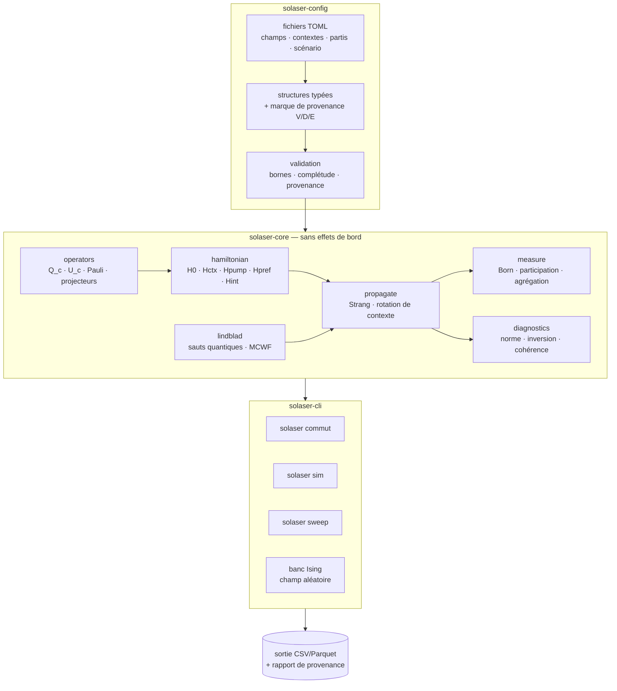
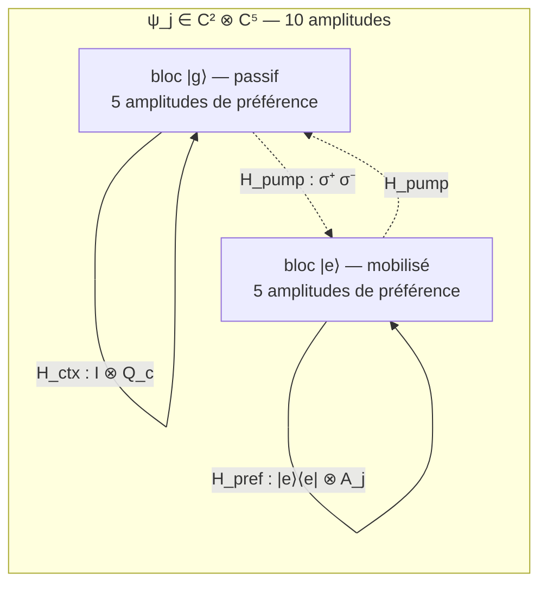
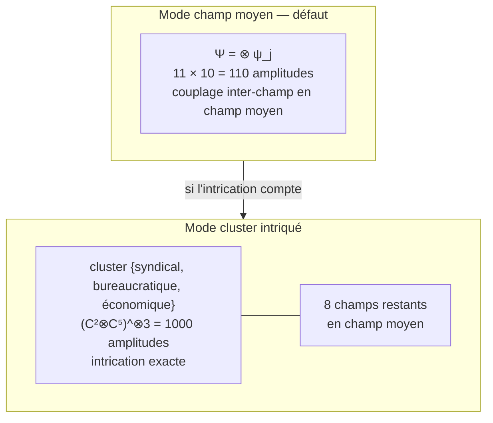
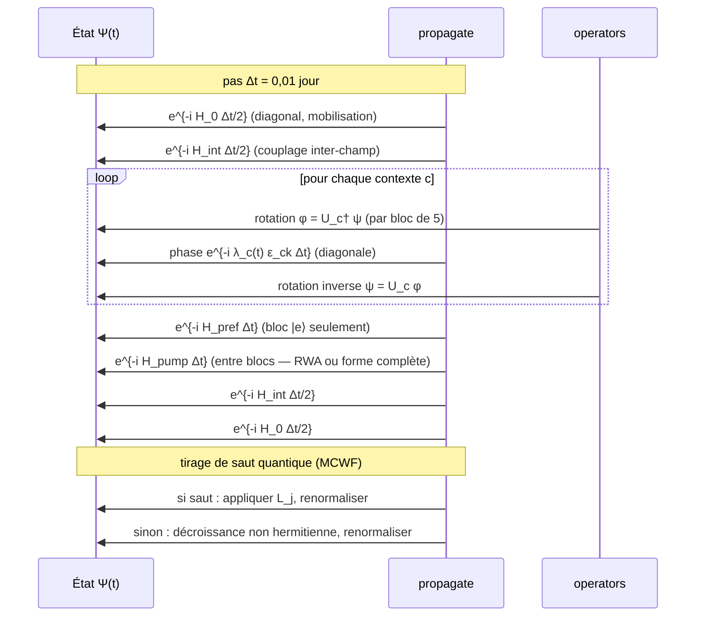
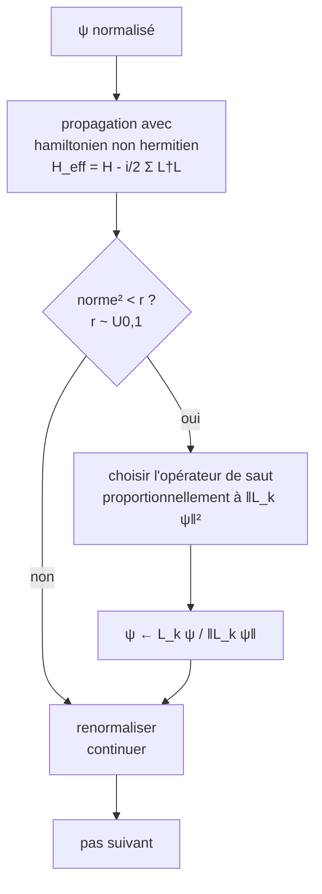
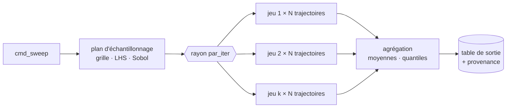

# Architecture — simulateur `solaser`

**Document de conception** — état : proposé, 2026-08-28.
Répond à ANL-006. À lire avec `01-exigences.md` et `03-specification.md`.

---

## 1. Vue d'ensemble

`solaser` est un **espace de travail Cargo** à trois caisses : un noyau
numérique sans effets de bord, une caisse de configuration typée, et une
interface en ligne de commande. La séparation est stricte : le noyau ne lit
aucun fichier et n'écrit rien.



**Le principe directeur** : `solaser-core` est une bibliothèque pure —
fonctions déterministes d'entrées vers sorties, aucune entrée-sortie, aucune
allocation surprise. C'est ce qui rend les tests de propriété possibles et le
parallélisme trivial.

---

## 2. Structure de l'espace de travail

```
solaser/
├── Cargo.toml                  espace de travail
├── crates/
│   ├── solaser-core/
│   │   └── src/
│   │       ├── lib.rs          #![forbid(unsafe_code)]
│   │       ├── types.rs        alias C = Complex<f64>, dimensions const
│   │       ├── state.rs        FieldState, MeanFieldState, ClusterState
│   │       ├── operators.rs    Pauli, projecteurs, ContextOp, lift Kronecker
│   │       ├── hamiltonian.rs  les cinq termes
│   │       ├── propagate.rs    Strang, rotation de contexte, pompage
│   │       ├── lindblad.rs     opérateurs de saut, MCWF, matrice densité
│   │       ├── measure.rs      Born, participation, agrégation
│   │       └── diagnostics.rs  norme, inversion, cohérence, commutateurs
│   ├── solaser-config/
│   │   └── src/
│   │       ├── lib.rs
│   │       ├── provenance.rs   Tracked<T> { value, provenance, source }
│   │       ├── champs.rs       ChampParams × 11
│   │       ├── contextes.rs    ContexteParams × 6, positions des partis
│   │       ├── scenario.rs     λ_c(t), Ω_j(t), φ_j, question de l'urne
│   │       └── validate.rs     bornes, complétude, dimension du cluster
│   └── solaser-cli/
│       └── src/
│           ├── main.rs         clap
│           ├── cmd_commut.rs
│           ├── cmd_sim.rs
│           ├── cmd_sweep.rs
│           └── bench_ising.rs  modèle de référence classique
├── config/
│   ├── champs.toml
│   ├── contextes.toml
│   ├── partis.toml
│   └── scenarios/
│       ├── base-2026.toml
│       └── multicouleur.toml
└── tests/
    ├── analytique_rabi.rs
    ├── analytique_dephasage.rs
    ├── convergence_strang.rs
    ├── proprietes.rs           hermiticité, unitarité, norme
    └── commutation.rs          ordre des contextes
```

---

## 3. Le modèle de données

### 3.1 L'état d'un champ

L'état d'un champ vit dans `C² ⊗ C⁵` : un **qubit de mobilisation** et un
**registre de préférence** sur cinq partis. Concrètement, dix amplitudes
complexes, organisées en deux blocs de cinq.



**Cette décomposition en deux blocs est le fait structurant de toute
l'implémentation.** Elle dit exactement où chaque terme agit :

| Terme | Agit sur | Coût par champ et par pas |
|---|---|---|
| `H_0` | diagonal en mobilisation | 10 multiplications |
| `H_ctx` | **à l'intérieur de chaque bloc**, via `U_c` (5×5) | 2 produits 5×5 par contexte |
| `H_pump` | **entre les deux blocs** | rotation 2×2 sur chaque paire d'amplitudes |
| `H_pref` | dans le seul bloc `|e⟩` | 1 produit 5×5 |
| `H_int` | entre champs, sur la mobilisation | dépend du couplage |

Le lift de Kronecker n'a donc jamais besoin d'être matérialisé en 10×10 :
**on applique `U_c` séparément aux deux blocs de cinq.** C'est le gain de
performance principal du design.

### 3.2 Les deux modes de représentation



**Le choix du cluster n'est pas arbitraire : il est dicté par la matrice de
recoupement d'ANL-001.** Le triplet retenu par défaut porte le recoupement de
≈ 930 000 personnes et l'incompatibilité irréductible d'ANL-004.

### 3.3 La traçabilité des paramètres

Tout paramètre est enveloppé :

```
Tracked<T> {
    value: T,
    provenance: Provenance,   // V | D | E
    source: String,           // « ANL-004 §4 », « Léger 21-24 août », …
}
```

Cette enveloppe traverse la configuration, n'entre **pas** dans le chemin chaud
— le noyau reçoit des valeurs nues — mais est recopiée dans les métadonnées de
sortie (ENF-5).

---

## 4. Le pas de temps

Le cœur de la boucle, en découpage symétrique de Strang.



**La rotation de contexte est le motif central**, et c'est exactement le
découpage d'opérateur de la dynamique quantique : appliquer un terme dans la
base où il est diagonal, en encadrant par un changement de base. Ici `U_c`
tient le rôle que joue la transformée de Fourier dans un propagateur de paquet
d'ondes.

Erreur globale attendue : `O(Δt²)`. Vérifiée par test (ENF-2.2).

---

## 5. La dissipation par trajectoires



Chaque trajectoire est un processus stochastique pur ; la moyenne d'ensemble
reproduit l'équation maîtresse de Lindblad. **Avantages retenus** : le
formalisme de fonction d'onde demandé par la session est conservé ; le coût
reste linéaire en la dimension et non quadratique ; le parallélisme est
trivial, chaque trajectoire étant indépendante.

Un mode matrice densité complète est conservé pour vérification croisée en
champ moyen (EF-4.3) : 110² éléments, coût négligeable.

---

## 6. Le parallélisme



Le parallélisme est **au niveau du jeu de paramètres**, pas de la trajectoire :
il maximise la localité et évite tout partage mutable. Chaque tâche reçoit une
graine dérivée déterministement de la graine maîtresse et de l'indice du jeu,
ce qui préserve la reproductibilité (ENF-1).

---

## 7. Les dépendances

| Caisse | Rôle | Pourquoi celle-là |
|---|---|---|
| `nalgebra` | algèbre linéaire à dimensions statiques | `SMatrix<C,5,5>` sans allocation ; chemin pur Rust, pas de BLAS |
| `num-complex` | `Complex<f64>` | standard |
| `rayon` | parallélisme de données | s'intègre par `par_iter`, sans runtime |
| `rand` + `rand_chacha` | tirages MCWF | reproductible entre plateformes |
| `serde` + `toml` | configuration | typage à la désérialisation |
| `clap` | interface en ligne de commande | dérive |
| `csv` | sortie tabulaire | suffisant ; `parquet` optionnel |
| `thiserror` | erreurs typées | pas de panique en chemin nominal |
| `tracing` | journalisation | coût nul si désactivé |
| `proptest` (dev) | tests de propriété | hermiticité, unitarité, norme |
| `criterion` (dev) | mesures de performance | vérifie ENF-3 |

Aucune dépendance système. `sobol` sera implémenté ou repris d'une caisse
légère selon disponibilité.

---

## 8. Décisions de conception, et leurs raisons

**D-1 — Dimensions statiques pour le registre de préférence.**
`P = 5` est fixé par le nombre de partis en 2026. Une dimension statique permet
au compilateur de dérouler et vectoriser les produits 5×5. *Conséquence
assumée : changer le nombre de partis exige une recompilation. C'est acceptable
pour un simulateur d'un scrutin donné, et ce serait inacceptable pour un outil
générique — arbitrage explicitement en faveur du premier.*

**D-2 — Ne jamais matérialiser les opérateurs 10×10.**
La structure en deux blocs de cinq rend tous les termes applicables sans
construire le produit de Kronecker. Gain d'un facteur ~4 sur le chemin chaud.

**D-3 — Le noyau ignore la provenance.**
Les marques `V`/`D`/`E` vivent dans la configuration et dans la sortie, jamais
dans la boucle. Cela évite un coût par pas pour une information qui ne change
pas.

**D-4 — MCWF plutôt que matrice densité par défaut.**
Conserve le formalisme de fonction d'onde demandé, coût linéaire, parallélisme
trivial. La matrice densité reste disponible comme oracle de vérification.

**D-5 — RWA optionnelle et déclarée par champ.**
ANL-006 établit que l'approximation séculaire suppose `Ω_j ≪ ω_j`, faux pour le
champ bureaucratique et le champ académique dans la paramétrisation proposée.
**Le programme ne doit pas imposer une approximation que l'analyse a déclarée
invalide** : la forme est un choix de configuration, et le validateur avertit
lorsque la RWA est demandée alors que `Ω_j ≳ ω_j`.

**D-6 — Le banc classique est dans le programme, pas à côté.**
Le modèle d'Ising à champ aléatoire est implémenté comme sous-commande, sur les
mêmes scénarios et les mêmes métriques. *Une comparaison qu'il faut assembler à
la main ne se fait jamais.*

**D-7 — `solaser commut` est livré en premier.**
C'est la sous-commande la moins coûteuse et la seule qui produise un résultat
**vérifiable** : les commutateurs `‖[Q_c,Q_{c'}]‖` confirment ou réfutent la
structure de compatibilité posée en ANL-004 et ANL-005. Elle ne dépend que de
la configuration et du module `operators`.
